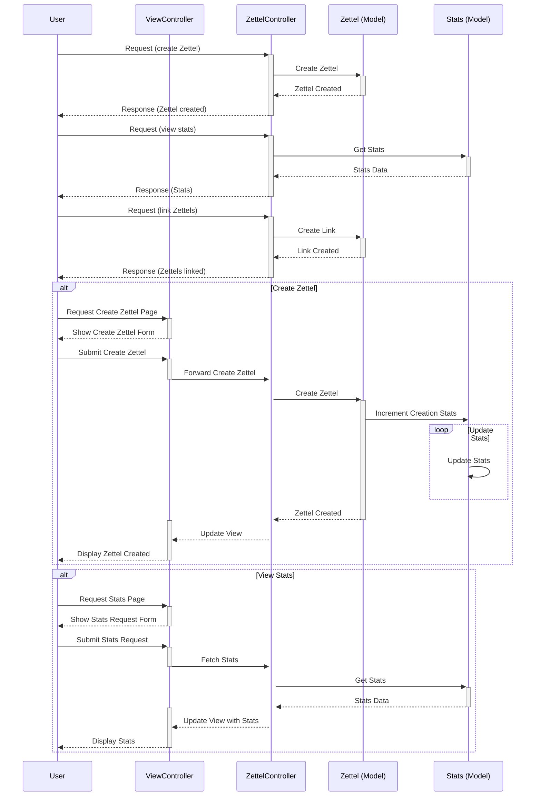
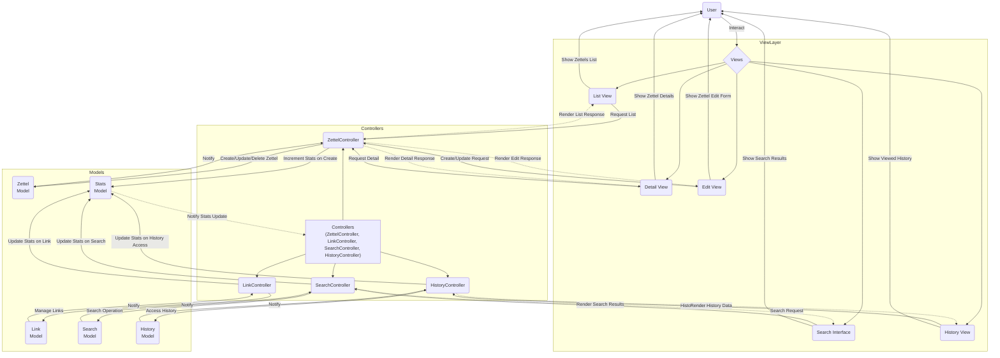

# Architecture

Documenting the `zet-cmd` architecture.

## Models

#### Zettel Model

`Zettel` is the central entity , representing individual notes or "zettels".
The model includes essential fields for identifying and managing zettels, as
well as auxiliary fields to enhance functionality, like Lines for content
manipulation and Links for inter-zettel connections.

#### Link Model

The Link model facilitates the connections between zettels, enabling the
creation of a network of related notes. Each link associates two zettels,
indicating a directional or bidirectional relationship.

#### Search Model

The Search model manages the logic and data involved in searching the
Zettelkasten. This model does not correspond directly to a database table but
encapsulates the criteria and algorithms for searching through zettels based on
various parameters.

#### History Model

The History model tracks the user's interaction history within the system, such
as recently viewed or edited zettels. This model helps in providing users with
a personalized experience by enabling quick access to previously interacted
zettels.

#### Stats Model

The Stats model collects and stores statistics related to various operations
within the system, such as the number of zettels created, links made, searches
performed, and historical interactions. It serves as a basis for analyzing the
usage patterns and efficiency of the Zettelkasten.

## Controllers

- `ZettelController`: Endpoint for Zettel management operations to process user
  requests like creation, update, and deletion of zettels.

- `LinkController`: Facilitates operations related to linking zettels,
  including creating and removing links, and querying for backlinks or all
  links related to a zettel.

- `SearchController`: Provides endpoints for searching the Zettelkasten, return
  search results.

- `HistoryController`: Offers access to a user's history within the
  Zettelkasten, such as recently edited or viewed zettels

- `ViewController`: Handles server-side rendering (SSR) of pages, presenting
  the user interface for interacting with the Zettelkasten. This includes
  rendering views for search results, zettel content, and navigation.

## Views

Views are the SSR templates or components that render the Zettelkasten's user
interface:

1. `List View`: Displays search results or collections of zettels, such as
   backlogs or history lists. This view is essential for users to browse
   through multiple zettels efficiently.

2. `Detail View`: Shows individual zettels in detail, including content, metadata
   (like creation and update times), and links/backlinks. This view is crucial
   for reading and understanding the content of a zettel.

3. `Edit View`: Provides a form or interface for creating new zettels or updating
   existing ones. This view is fundamental for content creation and editing
   within the Zettelkasten.

4. `Navigation and Search Interface`: Offers a comprehensive navigation bar or
   search box, enabling users to easily move between different parts of the
   Zettelkasten or to find specific zettels. This interface enhances the
   usability and accessibility of the system.

## Interaction Diagrams

### Flux Sequence Diagram E.g: Creating, Linking & Stats

This sequence diagram illustrates the process flow for creating zettels,
linking them, and viewing stats. It highlights the interactions between the
user, controllers, models, and views, showcasing the dynamic nature of the
Zettelkasten's operations

### Flux Diagram MVC

Showcases the zet-cmd system's architecture, detailing the flow from user
interactions through views—like List, Detail, and Edit Views—to controllers and
models for operations such as zettel creation, linking, and stats viewing. It
highlights the system's dynamic interaction between user requests, data
processing, and the subsequent update of views, illustrating the seamless
integration of components for efficient data management and responsive user
experience.

### Notes

It's important to note that the `Flux Sequence Diagram E.g: Creating, Linking &
Stats` is an example, and the models are not 100% complete since in development
implementations might change. This is an initial sketch and overview of the
`zet-cmd` architecture.

### Repository

1. <https://github.com/Odas0R/zet-cmd>
2. <https://github.com/Odas0R/zet-cmd/blob/main/ARCHITECTURE.md>
