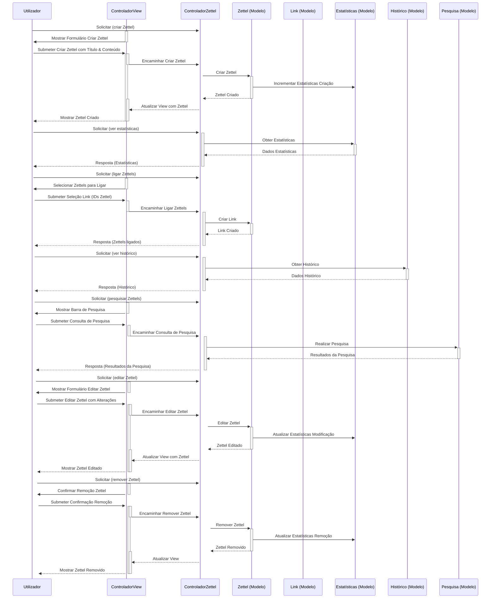
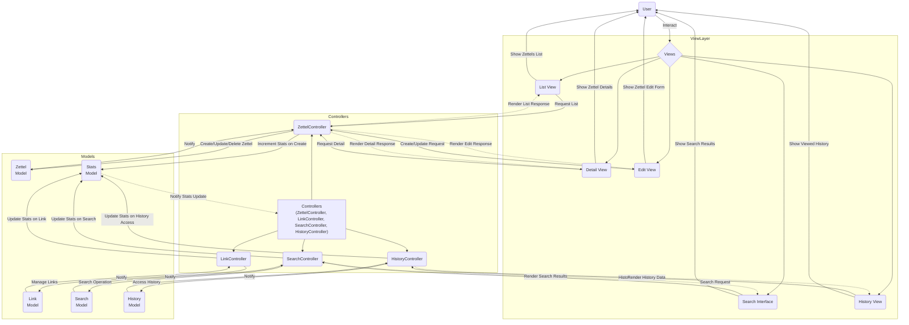

# Proposta Equipa Cmd-Zet

## Lista de Inputs e Outputs de Formas Aleatórias

|              | Inputs | Outputs |
| ------------ | ------ | ------- |
| De controlo  |        |         |
| Algoritmicos |        |         |

### Flux Sequence Diagram E.g: Creating, Linking & Stats

This sequence diagram illustrates the process flow for creating zettels,
linking them, and viewing stats. It highlights the interactions between the
user, controllers, models, and views, showcasing the dynamic nature of the
Zettelkasten's operations

### Flux Diagram MVC

Showcases the zet-cmd system's architecture, detailing the flow from user
interactions through views—like List, Detail, and Edit Views—to controllers and
models for operations such as zettel creation, linking, and stats viewing. It
highlights the system's dynamic interaction between user requests, data
processing, and the subsequent update of views, illustrating the seamless
integration of components for efficient data management and responsive user
experience.

### Notes

It's important to note that the `Flux Sequence Diagram E.g: Creating, Linking &
Stats` is an example, and the models are not 100% complete since in development
implementations might change. This is an initial sketch and overview of the
`zet-cmd` architecture.

### Repository

1. <https://github.com/Odas0R/zet-cmd>
2. <https://github.com/Odas0R/zet-cmd/blob/main/ARCHITECTURE.md>
