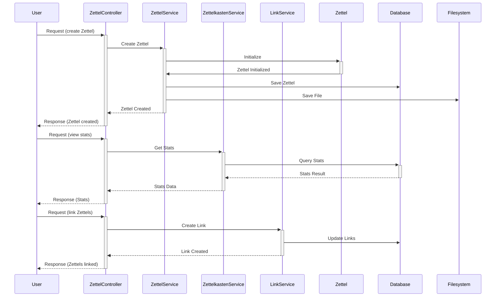
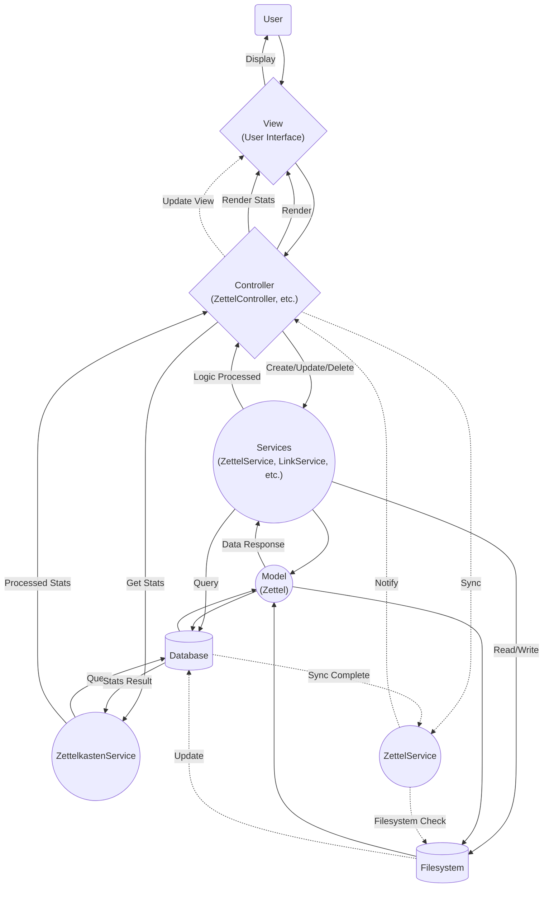

# Architecture

Documenting the `zet-cmd` architecture.

## Models

`Zettel` is the central entity , representing individual notes or "zettels".
The model includes essential fields for identifying and managing zettels, as
well as auxiliary fields to enhance functionality, like Lines for content
manipulation and Links for inter-zettel connections.

```go
type Zettel struct {
	ID        string `db:"id"`
	Title     string `db:"title"`
	Content   string `db:"content"`
	Path      string `db:"path"`
	Type      string `db:"type"`
	CreatedAt Time   `db:"created_at"`
	UpdatedAt Time   `db:"updated_at"`

	// Auxiliary fields (not stored in the database)
	Lines []string
	Links []*Zettel
}
```

## Controllers

- `ZettelController`: Endpoint for Zettel management operations, interfacing
  with `ZettelService` to process user requests like creation, update, and
  deletion of zettels.

- `LinkController`: Facilitates operations related to linking zettels,
  including creating and removing links, and querying for backlinks or all
  links related to a zettel.

- `SearchController`: Provides endpoints for searching the Zettelkasten,
  interfacing with `SearchService` to execute and return search results.

- `HistoryController`: Offers access to a user's history within the
  Zettelkasten, such as recently edited or viewed zettels, leveraging the
  `HistoryService`.

- `ViewController`: Handles server-side rendering (SSR) of pages, presenting
  the user interface for interacting with the Zettelkasten. This includes
  rendering views for search results, zettel content, and navigation.

## Views

Views are the SSR templates or components that render the Zettelkasten's user
interface:

1. List view for search results or zettel collections (e.g., backlog, history).
2. Detail view for individual zettels, displaying content, metadata, and
   links/backlinks.
3. Edit view for creating or updating zettels.
4. Navigation and search interfaces, providing easy access to various parts of
   the Zettelkasten.

## Flux Sequence Diagram E.g: Creating, Linking & Stats



## Flux Diagram MVC E.g: Creating, Linking & Stats


